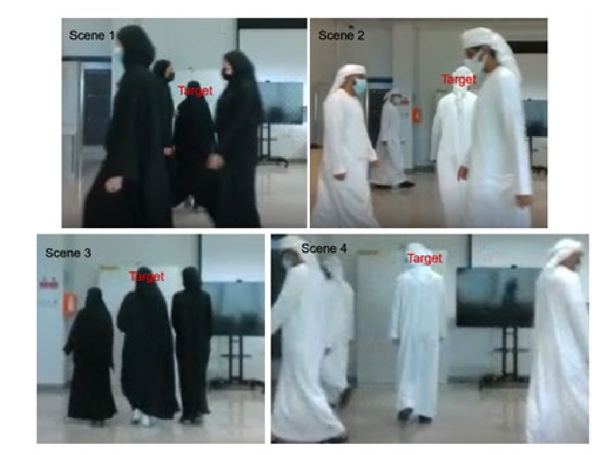

<h1 align="center">
Kandora and Abaya Uniform Tracking Dataset
</h1>

A Unique Dataset for Uniform Crowd Tracking

     
    
     

## Acknowledgement

- This dataset is developed by students in Khalifa University in the ECCE 625 Deep Learning System Design Course, supervised by **Prof. Naoufel Werghi**.
- For more details of this dataset, please check the paper **Person Monitoring by Full Body Tracking in Uniform Crowd Environment** in **International Conference on Advances in Data-driven Computing and Intelligent Systems (ADCIS 2022)**.
- You can contact with me by qiuyuezhibo@gmail.com for more information.
- Special thanks to **Prof. Naoufel Werghi**!

